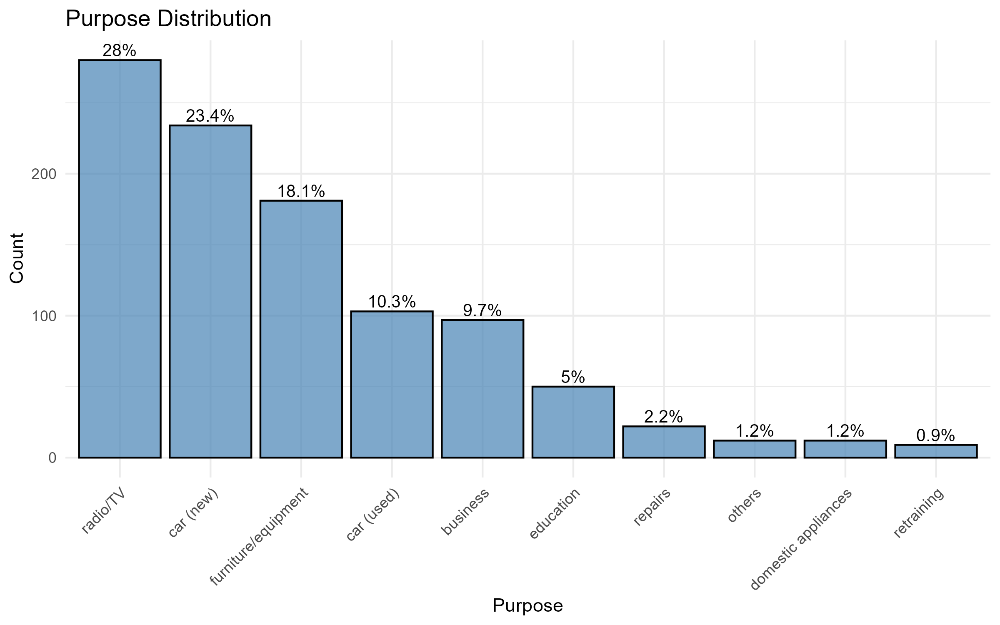
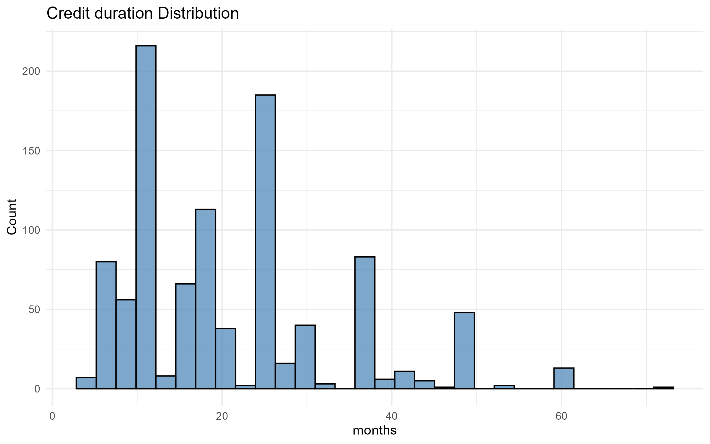
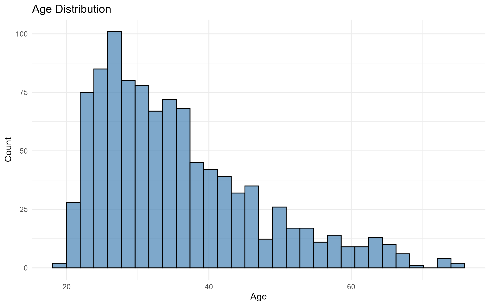

## **German Credit Data - Risk Analysis**

## Project Overview
This project develops and compares several machine learning models to predict whether a credit applicant is likely to default based on demographic, financial, and loan-related variables. Using the German Credit dataset from the UCI Machine Learning Repository, the analysis evaluates both linear and non-linear models to improve predictive performance and interpretability.

The objective is to:

- Identify the most influential factors contributing to credit risk, and

- Compare model performance using AUC, accuracy, and confusion matrices.

  ### Dataset Information
- **Dataset Name:** German Credit Data

- **Authors:** Hoffman, P. and K. Bach

- **Publisher:** UCI Machine Learning Repository

- **URL:**<https://archive.ics.uci.edu/ml/datasets/Statlog+%28German+Credit+Data%29>

## Methodology

### Data Cleaning and Preprocessing
The dataset contains 1000 observations with 21 variables, of which 7 are numerical and 13 are categorical.

- Missing values and duplicates: None were reported.

- Categorical variables: Encoded using dummy variables.

- Outliers: Detected in credit_amount and age, but these values were retained as they appear realistic in context.

### Exploratory Data Analysis (EDA)
Out of the 1000 observations, 700 were classified as good credit and 300 as bad credit.

Examining the distributions of numerical variables:

- age, credit_amount, credit_duration, number_of_dependents, and existing_credits are positively skewed, which aligns with realistic scenarios.
- installment_rate (the percentage of income used for installments) is negatively skewed.

  
  
  

  <b>Figure 1:</b> Credit Amount Distribution &nbsp;&nbsp;&nbsp;&nbsp;
  <b>Figure 2:</b> Credit Duration Distribution &nbsp;&nbsp;&nbsp;&nbsp;
  <b>Figure 3:</b> Age Distribution

## Key Results
- **Best AUC:** Random Forest (76%)
- **Fewest Errors:** XGBoost (48 total errors)
- **Feature Selection:** Lasso identified 25 critical features

## Models Compared
1. Logistic Regression (baseline)
2. Lasso Regression (L1 regularization)
3. Ridge Regression (L2 regularization)
4. Random Forest
5. XGBoost

## Key Steps

1. Data Cleaning & Preprocessing

- Handle missing values and duplicates.

- Convert categorical variables to dummy variables.

- Detect and handle outliers (where appropriate).

- Split the data into training and testing sets.

2. Exploratory Data Analysis (EDA)

- Visualize distributions and correlations.

- Understand variable importance and potential multicollinearity.

3. Modeling

- Logistic Regression (baseline).

- Lasso and Ridge (using glmnet and cv.glmnet).

- Random Forest and XGBoost for comparison.

4. Evaluation

- AUC-ROC

- Confusion matrix

- Visualize ROC curves and feature importance.

## Technologies Used
- R, tidyverse, caret
- glmnet (Lasso/Ridge)
- randomForest
- xgboost
- pROC, ggplot2

### Key Predictive Features (XGBoost)

The XGBoost model identified the following as most important for credit risk:

These findings align with domain knowledge in credit risk assessment.

| Rank | Feature              |    Gain   | Interpretation                                    |
| :--: | :------------------- | :-------: | :------------------------------------------------ |
|   1  | `checking_statusA14` | **0.235** | No checking account — *most important predictor!* |
|   2  | `duration`           |   0.133   | Loan duration (in months)                         |
|   3  | `credit_amount`      |   0.109   | Loan amount (in Deutsche Marks)                   |
|   4  | `age`                |   0.082   | Customer’s age                                    |
|   5  | `credit_historyA34`  |   0.053   | Credit history: “delay in paying off in the past” |
|   6  | `savingsA65`         |   0.048   | Savings: “unknown/no savings account”             |
|   7  | `purposeA41`         |   0.044   | Loan purpose: “used car”                          |
|   8  | `checking_statusA11` |   0.036   | Checking account: “< 0 DM” (negative balance)     |
|   9  | `installment_rate`   |   0.031   | Installment rate as % of disposable income        |
|  10  | `jobA174`            |   0.022   | Job type: “skilled employee/official”             |

## Interpretation: How Feature Importance Aligns with Credit Risk Logic

The feature importance results align well with established principles of credit risk assessment. The **checking account status** (checking_statusA14, checking_statusA11) emerged as the most influential factor, which makes intuitive sense — customers without an active checking account or with a negative balance often exhibit higher default risk due to weaker financial discipline, limited financial integration, or possible credit invisibility.

The **loan duration** and **credit amount** are also strong predictors: longer tenures and larger loans typically increase the probability of default because they extend exposure over time and place higher repayment burdens on borrowers (job loss, health issues, economic downturn, etc.). Similarly, **credit history** indicators such as past delays in payment (credit_historyA34) are classic measures of creditworthiness — borrowers with prior payment issues are statistically more likely to default. Further more, Delayed payments reveal:
  - Cash flow management issues
  - Prioritization of other obligations
  - Possible over-leverage
  - Financial stress signals

The **savings** and **installment rate** features reflect a borrower’s financial buffer and repayment capacity. Limited savings or higher installment-to-income ratios suggest reduced financial resilience. Finally, demographic and occupational factors like age and job type (jobA174) add additional context — younger or less stable borrowers might show higher credit risk compared to older or permanently employed individuals.

Overall, the model’s findings are consistent with financial domain expectations, enhancing its interpretability and practical relevance for credit scoring.

