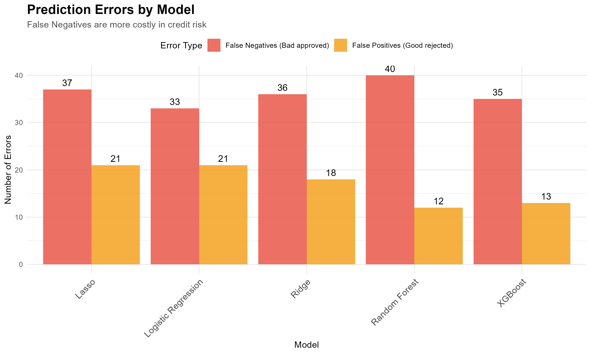
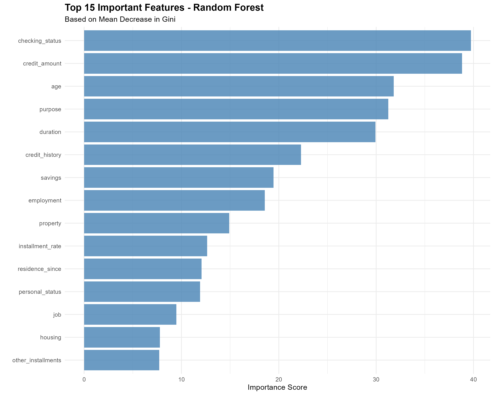

## **German Credit Data - Risk Analysis**

## Project Overview
This project develops and compares several machine learning models to predict whether a credit applicant is likely to default based on demographic, financial, and loan-related variables. Using the German Credit dataset from the UCI Machine Learning Repository, the analysis evaluates both linear and non-linear models to improve predictive performance and interpretability.

The objective is to:

- Identify the most influential factors contributing to credit risk, and

- Compare model performance using AUC, accuracy, and confusion matrices.

  ### Dataset Information
- **Dataset Name:** German Credit Data

- **Authors:** Hoffman, P. and K. Bach

- **Publisher:** UCI Machine Learning Repository

- **URL:**<https://archive.ics.uci.edu/ml/datasets/Statlog+%28German+Credit+Data%29>

## Methodology

### Data Cleaning and Preprocessing
The dataset contains 1000 observations with 21 variables, of which 7 are numerical and 13 are categorical.

- Missing values and duplicates: None were reported.

- Categorical variables: Encoded using dummy variables.

- Outliers: Detected in credit_amount and age, but these values were retained as they appear realistic in context.

### Exploratory Data Analysis (EDA)
Out of the 1000 observations, 700 were classified as good credit and 300 as bad credit.

Examining the distributions of numerical variables:

- age, credit_amount, credit_duration, number_of_dependents, and existing_credits are positively skewed, which aligns with realistic scenarios.
- installment_rate (the percentage of income used for installments) is negatively skewed.
- Loans for radio/TV accounted for the highest proportion (28%) of all applications, followed by new car (23.4%) and furniture/equipment (18.1%) purposes. (Figure 4)

  
    

  <b>Figure 1:</b> Credit Amount Distribution &nbsp;&nbsp;&nbsp;&nbsp;
  <b>Figure 2:</b> Credit Duration Distribution &nbsp;&nbsp;&nbsp;&nbsp;  

 
    

  <b>Figure 3:</b> Age Distribution &nbsp;&nbsp;&nbsp;&nbsp;
  <b>Figure 4:</b> Purpose Distribution &nbsp;&nbsp;&nbsp;&nbsp;  

#### Cross Tabulation Results

**1. Checking Account Status (checking_status)**

A total of 394 clients (39.4%) have no checking account (A14), and 348 of them (88%) are classified as good credit. Conversely, clients with negative or low balances (A11, A12) represent a substantial portion of the dataset (about 54%), indicating that many applicants hold limited liquidity. Interestingly, even among clients with no checking account, a majority still maintain good credit, suggesting that the absence of an account does not necessarily imply poor creditworthiness in this dataset. However, the relative proportion of bad credit cases is slightly higher among low or negative balance categories (A11, A12), indicating some association between checking status and credit class.

**2. Credit History (credit_history)**

The majority of applicants have either existing credits paid back duly (A32) or other credits at different institutions (A34). Interestingly, a large share of customers in the “critical/other credits” (A34) category still belong to the good credit class (83%), suggesting that multiple credit relationships do not necessarily indicate poor credit behavior in this dataset. Applicants with no prior credit history (A30) or fully repaid credits (A31) represent a small portion of the sample.

**3. Purpose of Loan (purpose)**

The most common loan purposes are radio/TV (28%), new car (23.4%), and furniture/equipment (18.1%). Within each category, good credit clients dominate (e.g., 218 out of 280 radio/TV loans are good).
This implies that loan purpose varies widely, but purpose alone may not strongly differentiate good vs. bad credit.

**4. Savings Account Balance (Savings)**
   
Most applicants (64%) have very low savings (<100 DM), and this group shows the highest proportion of bad credit cases, indicating a potential link between limited financial reserves and increased default risk. However, clients with higher savings or with “unknown/no savings account” status tend to have predominantly good credit ratings, suggesting that wealthier or financially established applicants are generally more creditworthy.

**6. Employment**
   
Clients with longer employment histories show higher chances of good credit status, while those unemployed or newly employed are more likely to default (more than 30%).

**7. Other variables (summary)**

*Personal status:* Overall male borrowers tend to have more good credits.

*Other debtors:* Most applicants are sole borrowers (A101), and these tend to be more creditworthy.

*Property:* Owning property (A121, A122) is linked to higher good credit rates. Unknown/no property category holds higher default percentage 43.5%

*Housing:* People with rented or own housing have higher good credit proportions than those with free housing.

*Other instalment plans:* Majority (81%) do not own an instalment plans and hold 27% default rate.

Telephone, job, and foreign worker status show similar trends — better socioeconomic conditions correlate with good credit.

**plots and details to be added**

### Multicollinearity Analysis

To identify potential multicollinearity among numerical variables, a correlation heatmap was generated. Most correlations were weak to moderate, indicating no severe multicollinearity in the dataset.

The highest correlation was observed between credit amount and duration (0.62), which is expected — longer credit durations typically correspond to larger loan amounts.
Other notable relationships include a negative correlation between installment rate and credit amount (-0.27), and a positive correlation between age and residence duration (0.27).

Overall, the correlation values suggest that no strong multicollinearity issue exists, and all variables were retained for modeling.

  
   
  <b>Figure 5:</b> Heat map.

## Modeling

To predict credit risk (good vs. bad credit), several supervised machine learning models were developed and evaluated.
The dataset was split into 80% training and 20% testing subsets.
Model performance was assessed based on accuracy, AUC, sensitivity, and specificity metrics.

### Logistic Regression 

A logistic regression model was fitted using the glm() function with a binomial family. This served as the baseline model for comparison.

### Regularized Logistic Regression (Lasso & Ridge)

To improve the baseline model and handle potential multicollinearity, regularized logistic regression methods were applied:

- Lasso (L1 penalty) – encourages sparsity by shrinking less important coefficients to zero, effectively performing variable selection.

- Ridge (L2 penalty) – penalizes large coefficients and helps reduce model variance.

Both models were trained using cross-validation to determine the optimal regularization parameter (lambda).

**Performances and Model Complexities**

| Model                   | Accuracy | AUC  | Sensitivity | Specificity | Balanced Accuracy | Non-Zero Features |
| :---------------------- | :------- | :--- | :---------- | :---------- | :---------------- | :---------------- |
| Logistic Regression     | 0.73     | 0.73 | 0.85        | 0.45        | 0.65              | 48                |
| Ridge                   | 0.73     | 0.73 | 0.87        | 0.40        | 0.64              | 48                |
| Lasso                   | 0.71     | 0.70 | 0.85        | 0.38        | 0.62              | 25                |

All three linear models achieved similar accuracy levels (~0.71–0.73).
However, Lasso reduced the number of active predictors from 48 to 25, providing a more interpretable and parsimonious model.
Ridge regression, while retaining all features, offered slightly higher AUC and stability by shrinking coefficients without eliminating them.

Overall, regularization improved model generalization and revealed which variables contribute most strongly to credit risk prediction.

### Random Forest
To capture potential nonlinear relationships and feature interactions, a Random Forest classifier was trained with 500 trees and mtry = sqrt(number of features).

Performance Summary
| Model             | Accuracy | AUC  | Sensitivity | Specificity | Balanced Accuracy |
| :---------------- | :------- | :--- | :---------- | :---------- | :---------------- |
| Random Forest     | 0.74     | 0.76 | 0.91        | 0.33        | 0.62              |

- Accuracy slightly improves to 0.74, and AUC increases to 0.76, suggesting better discrimination compared to logistic regression.

- Sensitivity is very high (0.91), meaning the model correctly identifies most of the good credit cases.

- Specificity is lower (0.33), so the model is less accurate in identifying bad credit cases.

- Random Forest captures nonlinearities and interactions in the data, which can explain the slight improvement over linear models.

- The model also provides feature importance, helping to identify the most influential predictors in credit risk classification.

### XGBoost

To further enhance model performance and capture complex nonlinear relationships, an Extreme Gradient Boosting (XGBoost) classifier was implemented. The model was tuned using cross-validation to identify the optimal learning rate, maximum tree depth, and number of boosting rounds.

Performance Summary:

| Model   | Accuracy | AUC  | Sensitivity | Specificity | Balanced Accuracy |
| :------ | :------- | :--- | :---------- | :---------- | :---------------- |
| XGBoost | 0.76     | 0.76 | 0.91        | 0.42        | 0.66              |

- The XGBoost model achieved an accuracy of 0.76 and an AUC of 0.756, representing a slight improvement over the Random Forest and logistic models.

- Sensitivity (0.91) remained high, showing that the model correctly identified most of the good credit cases.

- Specificity (0.42), though improved compared to other models, still indicates that distinguishing bad credit cases remains challenging — a common issue in imbalanced credit datasets.

- The model’s balanced accuracy of 0.66 demonstrates improved overall performance, maintaining a good trade-off between true positive and true negative rates.

- XGBoost’s gradient boosting approach efficiently captures feature interactions and nonlinearities, explaining its superior performance.

  
    

  <b>Figure 6:</b> AUC comparison between models &nbsp;&nbsp;&nbsp;&nbsp;
  <b>Figure 7:</b> Errors comparison between models &nbsp;&nbsp;&nbsp;&nbsp;  

## Interpretation: How Feature Importance Aligns with Credit Risk Logic

The models reveal several features as highly predictive of credit risk, and their importance aligns well with financial domain expectations:

**Checking Account Status:**

- Random Forest identifies checking account status as one of the most influential predictors, considering the variable as a whole.

- XGBoost highlights the specific category A14 (no checking account) as the top feature. According to the cross-tab, 88% of clients with no checking account were classified as good credit. While this appears counterintuitive, it reflects a dataset-specific association rather than causal logic. XGBoost captures category-level patterns that help distinguish between good and bad credit, complementing the broader variable-level view from Random Forest.

  
    

  <b>Figure 8:</b> Features seelcted by Random Forest. &nbsp;&nbsp;&nbsp;&nbsp;
  <b>Figure 9:</b> Features seelcted by XGBoost. &nbsp;&nbsp;&nbsp;&nbsp;  

**Loan Duration and Credit Amount:**

Longer tenures and larger loans generally increase default probability, as they extend exposure over time and place higher repayment burdens on borrowers (e.g., job loss, health issues, or economic downturns).

**Credit History:**

Indicators such as past delays in payment (credit_historyA34) are classic measures of creditworthiness. Delayed payments may reveal:

- Cash flow management issues

- Prioritization of other obligations

- Possible over-leverage

- Signs of financial stress

**Savings and Installment Rate:**

Savings balance and installment-to-income ratio reflect financial buffer and repayment capacity. Limited savings or high installment rates suggest reduced resilience to shocks.

**Demographic and Occupational Factors:**

Age and job type (jobA174) provide additional context — younger or less stably employed borrowers may show higher credit risk compared to older or permanently employed individuals.

**Summary:**

- The models consistently identify checking account status, credit amount, loan duration, credit history, savings, and installment rate as key predictors.

- Feature importance captures predictive patterns in the dataset, which may sometimes differ from general expectations (e.g., no checking account correlating with good credit).

- Overall, the findings are interpretable and align with financial reasoning, enhancing the practical relevance of the models for credit scoring.

### Hypothetical Financial Comparison: Random Forest vs XGBoost

To illustrate the potential business impact of model predictions, we performed a hypothetical comparison using the following assumptions:

- Profit per approved good customer: €2,000

- Loss per approved bad customer: €5,000

| Model         | Good Approvals | Bad Approvals | Revenue (€) | Cost (€) | Net Expected Profit (€) |
| ------------- | -------------- | ------------- | ----------- | -------- | ----------------------- |
| Random Forest | 127            | 44            | 254,000     | 220,000  | 34,000                  |
| XGBoost       | 127            | 35            | 254,000     | 175,000  | 79,000                  |

**Interpretation:**

- Random Forest approves slightly more customers, generating additional revenue from good approvals, but also incurs higher costs from bad approvals.

- XGBoost approves fewer customers but reduces losses from bad approvals.

Depending on business priorities (maximizing revenue vs minimizing losses), either model could be preferred.

This demonstrates how feature selection and prediction performance translate into practical financial considerations.

⚠️ Note: This is a hypothetical scenario for illustrative purposes. Real-world deployment would require more detailed financial modeling and risk assessment.
